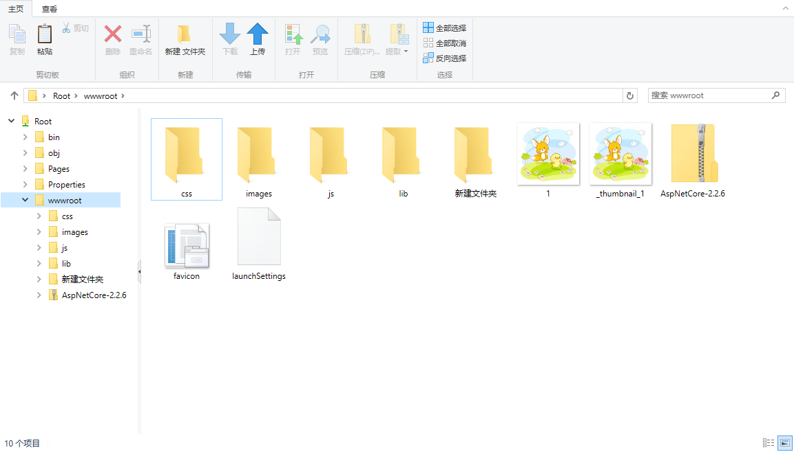

FileManagerWebUI
========================================

Packages
--------

| Package | NuGet Stable | NuGet Pre-release | Downloads | MyGet |
| ------- | ------------ | ----------------- | --------- | ----- |
| [FileManager.Core](https://www.nuget.org/packages/FileManager.Core/) |  |  |  |  |
| [FileManager.Storage.Standard](https://www.nuget.org/packages/FileManager.Storage.Standard/) |  |  |  |  |
| [FileManager.Storage.Compress](https://www.nuget.org/packages/FileManager.Storage.Compress/) |  |  |  |  |
| [FileManager.Storage.Ftp](https://www.nuget.org/packages/FileManager.Storage.Ftp/) |  |  |  |  |
| [FileManager.Storage.WebDav](https://www.nuget.org/packages/FileManager.Storage.WebDav/) |  |  |  |  |
| [FileManager.Storage.MongoDB](https://www.nuget.org/packages/FileManager.Storage.MongoDB/) |  |  |  |  |
| [FileManager.UI](https://www.nuget.org/packages/FileManager.UI/) |  |  |  |  |
| [FileManager.UI.Explorer](https://www.nuget.org/packages/FileManager.UI.Explorer/) |  |  |  |  |
| ~~*[FileManager.UI.RichFilemanager](https://www.nuget.org/packages/FileManager.UI.RichFilemanager/)*~~ |  |  |  |  |
| [FileManager.UI.WebApi](https://www.nuget.org/packages/FileManager.UI.WebApi/) |  |  |  |  |
| [FileManager.UI.WebApi.Sdk](https://www.nuget.org/packages/FileManager.UI.WebApi.Sdk/) |  |  |  |  |

Features
-------------
在线文件管理系统

